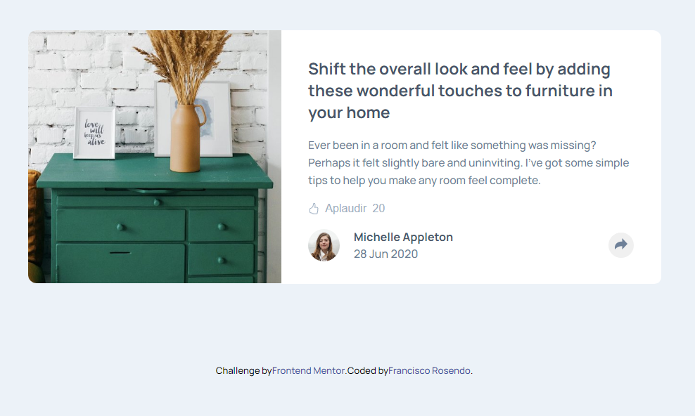
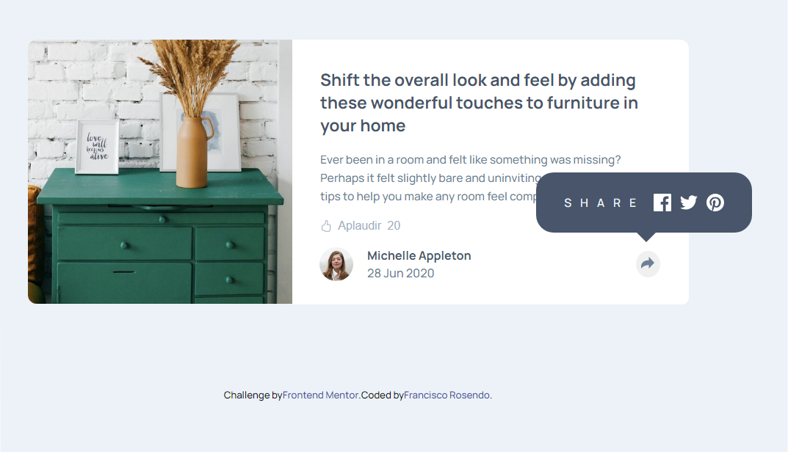
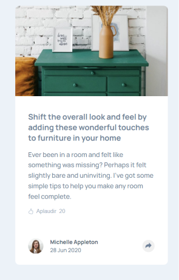
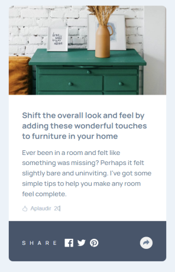

# Frontend Mentor - Article preview component solution

This is a solution to the [Article preview component challenge on Frontend Mentor](https://www.frontendmentor.io/challenges/article-preview-component-dYBN_pYFT). Frontend Mentor challenges help you improve your coding skills by building realistic projects. 

## Table of contents

- [Overview](#overview)
  - [The challenge](#the-challenge)
  - [Screenshot](#screenshot)
  - [Links](#links)
- [My process](#my-process)
  - [Built with](#built-with)
  - [What I learned](#what-i-learned)
  - [Continued development](#continued-development)
  - [Useful resources](#useful-resources)
- [Author](#author)
- [Acknowledgments](#acknowledgments)

## Overview

### The challenge

Users should be able to:

- View the optimal layout for the component depending on their device's screen size
- See the social media share links when they click the share icon

### Screenshot
### Desktop

### Mobile

### Links

- Reposit URL: [github](https://github.com/rosendo2015/article-preview)
- Solution URL: [Vercel](https://article-preview-liard.vercel.app/)
- Live Site URL: [Article Preview Liard](https://article-preview-liard.vercel.app/)

## My process

### Built with

- Semantic HTML5 markup
- CSS custom properties
- Flexbox
- CSS Grid
- Mobile-first workflow
- [React](https://reactjs.org/) - JS library - React framework
- [Styled Components](https://styled-components.com/) - For styles
- [Styled module](https://styled-module.com/) - For styles

## Author

- Linkedin - [Francisco Rosendo](https://www.linkedin.com/in/francisco-rosendo-coelho/)
- Frontend Mentor - [@rosendo2015](https://www.frontendmentor.io/profile/@rosendo2015)
- Twitter - [@Rosendo92671729](https://twitter.com/Rosendo92671729)